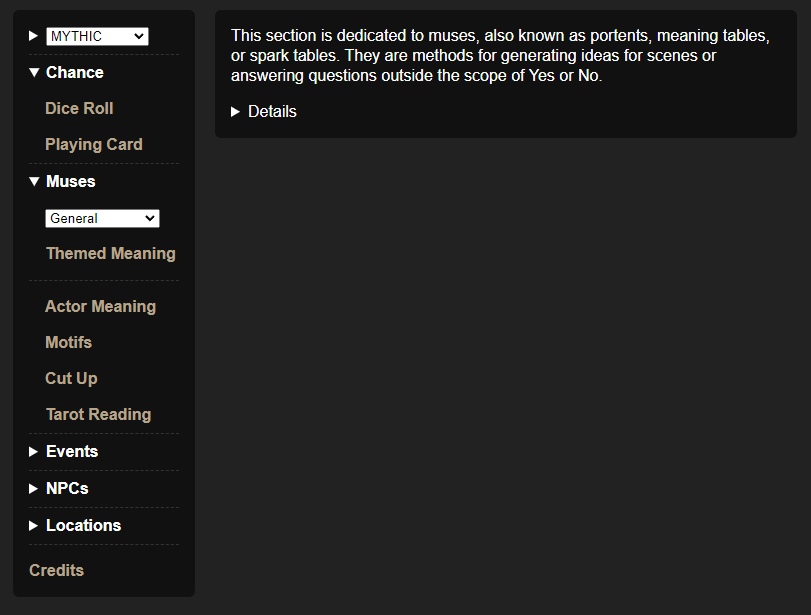

This toolkit takes the tables from popular oracles and quickly rolls on them with the click of a button. My goal was to provide extensive support for *Mythic*, *CRGE/UNE*, *Motif*, and *Calypso*. This utility covers nearly all functions of each system, excluding only those that do not require dice rolls or that were deemed unlikely to be used by players.

Beyond simple "roll a d100 and spit out an item" table rolls, this utility also supports complex systems such as:

- *Mythic*'s Behavior Checks for NPC emulation
- *Adventure Crafter*'s Turning Point generator for plotlines
- *BOLD*'s Waylay generator for backstories
- *Motif*'s Action Engine with adjustable Skillset
- Calypso's Strive checks using Light & Dark die and Hindrances
- and many more.

Creating a mobile friendly application alongside a desktop counterpart was one of the main goals of this project. And so, this web app is designed for both desktop and mobile environments and comes as a portable webpage, a windows desktop application, and an android app.

This application uses [NW.js](https://nwjs.io/) for its windows application and [Capacitor](https://capacitorjs.com/) for its android app, both of which can be used in combination with the HTML file to create Linux, Mac, and iOS versions.

 

You can find a live version of the web app running [here](https://tayruh.github.io/solo/solo-roleplaying-toolkit.html).

